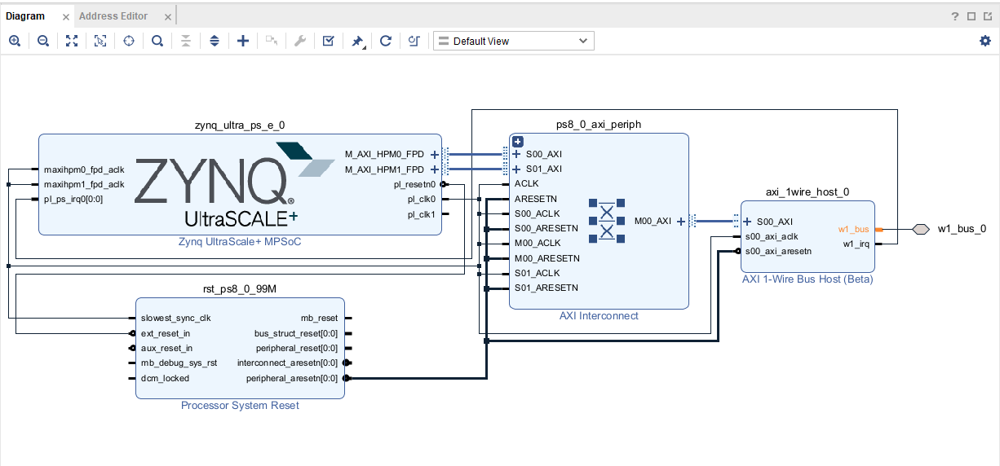
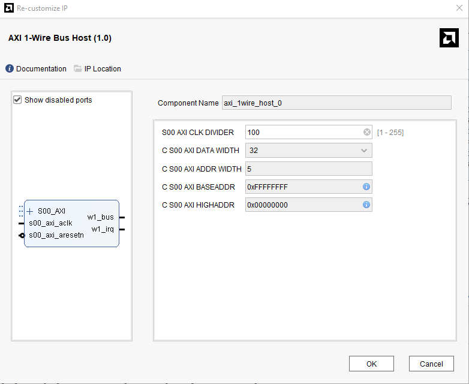
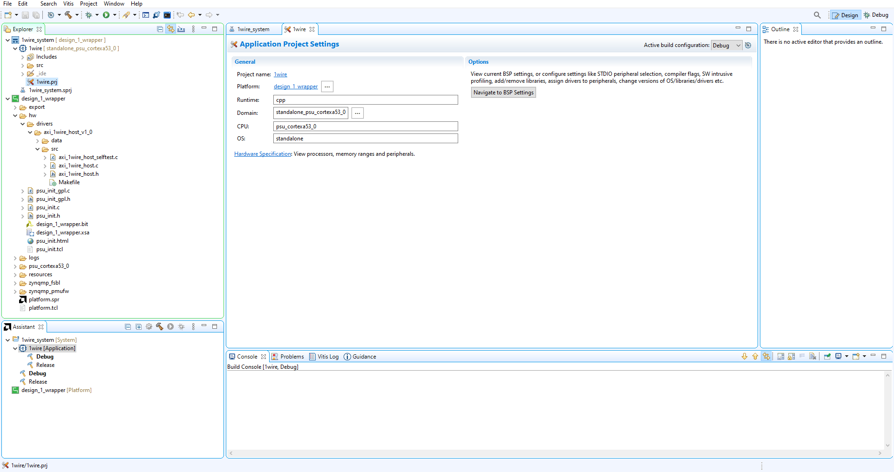

<table class="sphinxhide">
 <tr>
    <td align="center">
    </td>
 </tr>
</table>

<h1 align="center">AMD AXI_1WIRE_HOST IP</h1>

## :warning: Disclaimer

**The AXI 1-Wire Host IP is provided free of charge with no guarantees or support from AMD. Limited testing has been done on the IP; You are responsible for testing your designs and ensuring proper functionality.**

AMD is not providing maintenance of the IP. If you discover any bugs or problems with the IP, create a new issue in this repository to inform AMD if future releases ever get done.

## Introduction

The AMD IP AXI 1-Wire Host core provides a 1-Wire bus controller interface to the AXI interface. This 32-bit soft IP core is designed to interface with the AXI4-Lite interface. This IP is compatible with the **AXI 1-wire host driver for AMD programmable logic IP core** Linux driver.

## Features

- Supports the AXI4-Lite interface specification.
- Supports the 1-Wire bus protocol.
- Supports the following 1-Wire bus master signals:
   - Reset/Presence signal
   - Write bit (0 or 1) signal
   - Read bit (0 or 1) signal.
- Supports optional interrupt request generation.
- Supports soft reset of the 1-Wire Host core.
- Supports configurable single general purpose I/O (GPIO) channel with bit-banging of the 1-Wire bus.
- Compatible with the **AXI 1-wire host driver for AMD programmable logic IP core** Linux driver.

## Functional Description

The AXI 1-Wire Host provides a 1-Wire bus controller interface to an AXI4-Lite interface. The AXI 1-Wire supports the 1-Wire bus protocol with the essential 1-Wire bus master signals being supported. The AXI 1-Wire Host IP contains a 1-Wire Host Core Controller which guarantees protocol timing for driving off-board devices. It can be configured to generate an interrupt when the controller completes the signal instruction cycle. The AXI 1-Wire Host can be configured to bypass the 1-Wire Host Core Controller to manipulate the 1-Wire bus as a GPIO.
The AXI 1-Wire Host primary components are the AXI4-Lite Interface, the 1-Wire Host Core Controller, the Interrupt controller, and the GPIO module.

### AXI4-Lite Interface

The AXI4-Lite Interface module implements a 32-bit AXI4-Lite slave interface for accessing 1-Wire Host and GPIO registers. For additional details about the AXI4-Lite slave interface, see the specification usage section of the *AXI4-Lite IPIF LogiCORE IP Product Guide* [(PG155)](https://docs.xilinx.com/v/u/en-US/pg155-axi-lite-ipif).

### 1-Wire Host Core Controller

The 1-Wire Host Core Controller implements hardware to guarantees 1-Wire protocol timing to drive off-board devices. It is controlled by an external processor to generate and report the 1-Wire bus master signals. It supports the following five instructions:

- Reset/Presence
- Write bit (0 or 1)
- Read bit (0 or 1)
- Write byte
- Ready byte.

### Interrupt Controller

The interrupt control gets the interrupt status from the 1-Wire Host Core Controller and generates an interrupt to the external processor.

The GPIO module implements a 3-state buffer to bypass the 1-Wire Host Core Controller and to manipulate the 1-Wire bus through GPIO.

## Port Descriptions

The AXI 1-Wire HOST I/O signals are listed and described in the following table.
| Signal Name | Interface | I/O | Description |
|--|--|--|--|
| s00_axi_aclk| Clock | I | AXI Clock|
| S00_axi_aresetn | Reset | I | AXI Reset, active-Low.|
| s00_axi_*| S_AXI | NA | AXI4-Lite Slave Interface signals. See Appendix A of the *Vivado AXI Reference Guide* [(UG1037)](https://docs.xilinx.com/v/u/en-US/ug1037-vivado-axi-reference-guide) for AXI4, AXI4-Lite and AXI4-Stream signals.|
| w1_bus | Signal | IO | 1-Wire bus input-output pin.|
| w1_irq | Interrupt | O | AXI 1-Wire Host interrupt. Active-High, level sensitive signal.|

## User Parameters

The AXI 1-Wire Host user parameters are listed and described in the following table.
| Parameter Vivado IDE Name | Parameter Name | Default Value | Description |
|--|--|--|--|
| S00 AXI CLK DIVIDER | CLK_DIV_VAL_TO_1MHz | 100 | S00_AXI_CLK divider value to produce a 1 MHz clock (e.g., for a 100MHz S00_AXI_CLK, the divider value would be 100). |

## Register Space

The AXI 1-Wire Host registers are listed and described in the following table.
| Address Space Offset | Register Name | Access Type | Default Value | Description|
|--|--|--|--|--|
| 0x0000 | w1_INSTR| R/W | 0x0 | AXI 1-Wire Host Instruction register.|
| 0x0004 | w1_CTRL | R/W | 0x0 | AXI 1-Wire Host Control signal register.|
| 0x0008 | w1_IRQCTRL| R/W | 0x0 | AXI 1-Wire Host Interrupt Control register.|
| 0x000C | w1_STAT| R/W | 0x0 | AXI 1-Wire Host Status signal register.|
| 0x0010 | w1_RXDATA | R/W | 0x0 | AXI 1-Wire Host Received data through 1-Wire Host Core Controller register.|
| 0x0014 | w1_GPIODATA | R/W | 0x0 | AXI 1-Wire Host Received data through GPIO register.|
| 0x0018 | w1_IPVER| R | 0x7600_0100 | AXI 1-Wire Host Version register.|
| 0x001C | w1_IPID| R | 0x10EE_4453 | AXI 1-Wire Host Identification register.|

### AXI 1-Wire Host Instruction Register (w1_INSTR)

The AXI 1-Wire Host Instruction Register is used by the external processor to specify the instruction to be executed by the 1-Wire Host. The functionality of this register are detailed in the following table.
| Bits | Field Name | Description |
|--|--|--|
| [31] | GPIO/Controller enable | 0 = Controller enable / GPIO disable <br/> 1 = Controller disable / GPIO enable |
| [23] | GPIO Tri State | 0 = I/O pin configured as output, write to the 1-Wire bus. <br/> 1 = I/O pin configured as input, read from the 1-Wire bus.|
| [16] | GPIO Output | 1-Wire bus level when configured as GPIO output.|
| [11:8] | Controller Instruction | 1000 = Reset/Presence pulse <br/> 1110 = Write bit pulse <br/> 1100 = Read bit pulse <br/> 1111 = Write byte (8 write bit pulses) <br/> 1101 = Ready byte (8 read bit pulses)|
| [7:0] | Data to write | Bit(s) to transmit on the 1-Wire bus. If the controller instruction is *Write Bit*, only the LSB is transmitted, if the instruction is *Write Byte*, all 8 bits are transmitted. |

### AXI 1-Wire Host Control Register (w1_CTRL)

The AXI 1-Wire Host Control Register is used by the external processor to control the process of the 1-Wire Host Core Controller. The functionality of this register are details in the following table.
| Bits | Field Name | Description |
|--|--|--|
| [31] | Reset Controller | Soft reset of 1-Wire Host Core Controller, active-High. |
| [0] | GO Signal | Used by the external processor to signal to the 1-Wire Host Core Controller that the Instruction can be fetched and executed. |

### AXI 1-Wire Host Interrupt Control Register (w1_IRQCTRL)

The AXI 1-Wire Host Interrupt Control Register is used by the external processor to mask the interrupts generated by the 1-Wire Host Core Controller. The functionality of this register are details in the following table.
| Bits | Field Name | Description |
|--|--|--|
| [4] | Ready Interrupt Mask | 0: The 1-Wire Host Core Controller *READY* signal does not raise an interrupt. <br/> 1: The 1-Wire Host Core Controller *READY* signal does raise an interrupt, active-high.|
| [0] | Done Interrupt Mask | 0: The 1-Wire Host Core Controller *DONE* signal does not raise an interrupt. <br/> 1: The 1-Wire Host Core Controller *DONE* signal does raise an interrupt, active-high.|

### AXI 1-Wire Host Status Register (w1_STAT)

The AXI 1-Wire Host Status Register is used by the 1-Wire Host Core Controller to report the execution status to the external processor. The functionality of this register are details in the following table.
| Bits | Field Name | Description |
|--|--|--|
| [31] | Presence | 0: The 1-Wire Host Core Controller detected device(s) on the 1-Wire bus during the Reset/Presence pulse sequence. <br/> 1: The 1-Wire Host Core Controller did not detect device(s) on the 1-Wire bus during the Reset/Presence pulse sequence.|
| [4] | Ready | 0: The 1-Wire Host Core Controller is not ready to execute the next instruction. Either is executing the current instruction or is waiting for the *GO* signal to be cleared. <br/> 1 : The 1-Wire Host Core Controller is ready to receive and execute a new instruction.|
| [0] | Done | 0: The 1-Wire Host Core Controller has completed the instruction execution and has written received data (if applicable) to register. <br/> 1: The 1-Wire Host Core Controller has not completed the instruction execution.|

### AXI 1-Wire Host Received Data Register (w1_RXDATA)

The AXI 1-Wire Host Received Data Register is used by the 1-Wire Host Core Controller to store the received data. The functionality of this register are details in the following table.
| Bits | Field Name | Description |
|--|--|--|
| [7-0] | Read Data | Bits received from the 1-Wire bus. If the controller instruction is *Read Bit*, the bit is stored in the least significant bit (LSB), if the instruction is *Read Byte*, all eight bits are stored.|

### AXI 1-Wire Host Received Data Register (w1_GPIODATA)

The AXI 1-Wire Host GPIO Read Data Register is used to store the 1-Wire bus level. The functionality of this register are details in the following table.
| Bits | Field Name | Description |
|--|--|--|
| [0] | Read GPIO | The 1-Wire bus level is consistently stored. It can be used to read the bus level when using the IP in GPIO mode or to monitor the 1-Wire bus level. |

## Programming Sequence

The following steps are helpful in accessing the AXI 1-Wire Host.

### Using the 1-Wire Host Core Controller

 1. Reset the Core (write 0x8000_0000 to register w1_CTRL).
 2. Enable the Ready interrupt mask (write 0x0000_0010 to register w1_IRQCTRL).
 3. Wait for the interrupt to be raised and read the w1_STAT register to ensure the Ready signal raised the interrupt.
 4. Clear the interrupt mask (write 0x0000_0000 to register w1_IRQCTRL).
 5. Write instruction (write 0x0000_0*zyy* to w1_INSTR, *z* is the instruction and *yy* the data to be transmitted if applicable. E.g., to transmit byte 0110_1010, instruction will be 0x0000_0F6A).
 6. Signal Go and clear Reset (write 0x0000_0001 to w1_CTRL).
 7. Enable the Done interrupt mask (write 0x0000_0001 to register w1_IRQCTRL).
 8. Wait for the interrupt to be raised and read the w1_STAT register to ensure the Done signal raised the interrupt.
 9. Clear the interrupt mask (write 0x0000_0000 to register w1_IRQCTRL).
 10. Read the data register (w1_RXDATA) to fetch the received bits, if applicable.
 11. Clear the Go signal (write 0x0000_0000 to w1_CTRL.
 12. Return to step 2.

Steps 2, 3, 4, 7, 8, and 9 suppose the usage of the interrupt. If the interrupt is not used, steps 2, 3, and 4 can be replace by a loop that reads the Ready value in the w1_STAT to be 1 and by replacing steps 7, 8, and 9 with a loop that reads the Done value in the w1_STAT to be 1.

### Using the GPIO

For reading the 1-Wire bus level:

 1. Configure the AXI 1-Wire Host for GPIO read (write 0x8080_0000 to w1_INSTR).
 2. Read the w1_GPIODATA register.

For writing to the 1-Wire bus:

 1. Configure the AXI 1-Wire Host for GPIO write (write 0x808*y*_0000 to w1_INSTR, replace *y* with 0 to write 0, 1 to write 1).

## Drivers

### Linux Drivers

The upstreamed **AXI 1-wire host driver for AMD programmable logic IP core** Linux driver can be used with a Linux system to interface with the IP.

### Baremetal Drivers

Rudimentary baremetal drivers are provided with the AXI 1-Wire Host IP to develop applications using AMD Vitis&trade;. The driver does not implement an interrupt; you are encouragekd to implement your own version of the baremetal driver to make use of the interrupt. To include the provided baremetal drivers, include the *axi_1wire_host.h* file. The provided driver functions are listed below.

```
 /**
 *
 * Reset the 1-Wire Microcontroller.
 * 
 * @param baseaddr is the base address of the AXI_1WIRE_HOST instance to be worked on.
 * 
 * @return
 * 
 */
 void AXI_1WIRE_HOST_Reset(u32 baseaddr);
 
 /**
 *
 * Performs the touch-bit function - write a 0 or 1 and reads the bus level.
 *
 * @param baseaddr is the base address of the AXI_1WIRE_HOST instance to be worked on.
 *        bit is the level to write
 * 
 * @return The level read
 * 
 */
 u8 AXI_1WIRE_HOST_TouchBit(u32 baseaddr, u8 bit);
 
 /**
 *
 * Performs the read-byte function.
 * 
 * @param baseaddr is the base address of the AXI_1WIRE_HOST instance to be worked on.
 * 
 * @return The value read
 * 
 */
 u8 AXI_1WIRE_HOST_ReadByte(u32 baseaddr);
 /**
 *
 * Performs the write-byte function.
 * 
 * @param baseaddr is the base address of the AXI_1WIRE_HOSTinstance to be worked on.
 *        byte is the byte to write
 * 
 */
 void AXI_1WIRE_HOST_WriteByte(u32 baseaddr, u8 byte);
 
 /**
 *
 * Performs the Reset-Presence function.
 * 
 * @param baseaddr is the base address of the AXI_1WIRE_HOST instance to be worked on.
 * 
 * @return 0=Device present, 1=No device present
 * 
 */
 u8 AXI_1WIRE_HOST_ResetBus(u32 baseaddr);
 
 /**
 *
 * Run a self-test on the driver/device. Note this may be a destructive test if resets of the device are performed.
 * 
 * If the hardware system is not built correctly, this function may never return to the caller.
 *
 * @param baseaddr is the base address of the AXI_1WIRE_HOST instance to be worked on.
 *
 * @return
 *
 * - XST_SUCCESS if all self-test code passed
 * - XST_FAILURE if any self-test code failed
 * 
 * @note Caching must be turned off for this function to work.
 * @note Self test may fail if data memory and device are not on the same bus.
 *
 */
 XStatus AXI_1WIRE_HOST_SelfTest(u32 baseaddr);
 
 /**
 *
 * Read the 1-Wire bus level. The 1-Wire bus is controlled through GPIO.
 *
 * @param baseaddr is the base address of the AXI_1WIRE_HOST instance to be worked on.
 *
 * @return Bus level
 *
 */
 u8 AXI_1WIRE_HOST_GPIO_Read(u32 baseaddr);
 
 /**
 *
 * Set the 1-Wire bus level. The 1-Wire bus is controlled through GPIO.
 * 
 * @param baseaddr is the base address of the AXI_1WIRE_HOST instance to be worked on.
 *        bit is the bus level
 *
 * @return
 *
 */
 void AXI_1WIRE_HOST_GPIO_Write(u32 baseaddr, u8 bit);
```

## Example Design Flow

This chapter describes the process of creating a design targeting the AMD Kria&trade; KD240 Drives Starter Kit. It includes customizing and generating the AXI 1-Wire Host, constraining the core, the synthesis and implementation steps to generate the hardware design, and the software integration.

This design flow requires the AMD Vivado™ and Vitis Unified Software Platform development tools. It has been tested with the 2023.1 and 2023.2 tools release.

### Customizing and Generating the AXI 1-Wire Host

This section includes information about using the Vivado Design Suite IP Integrator to generate a block design and to customize and generate the AXI 1-Wire Host. For more information on how to create an hardware design using the IP Integrator, refer to the *Vivado Design Suite User Guide: Designing IP Subsystems Using IP Integrator* [(UG994)](https://docs.xilinx.com/r/en-US/ug994-vivado-ip-subsystems). The following steps describe the process of creating a complete hardware design for the Kria KD240 Drives Starter Kit; the same process with some adjustments, can be use to target another device.

1. Create a new Vivado project targeting the Kria KD240 Drives Starter Kit with the companion cards.
2. Create a Block Design.
3. In the new Block Design, add the AMD Zynq™ UltraScale+™ MPSoC IP and *Run Block Automation* to apply Board Preset.
4. Add the AXI 1-Wire Bus Host IP to the block design and *Run Connection Automation* with the default settings. This will add a Processor System Reset and an AXI Interconnect blocks. It will also connect the clocks to the AMD Zynq UltraScale+ MPSoC `pl_clk0` 100 MHz clock and all the reset ports and the AXI interfaces.
5. *Run Connection Automation* a second time with the default settings to connect the second AMD Zynq UltraScale+ MPSoC AXI interface.
6. Connect the AXI 1-Wire Bus Host w1_irq port to the AMD Zynq UltraScale+ MPSoC pl_ps_irq0[0:0] port.
7. Right-click the AXI 1-Wire Bus Host w1_bus port and click **Make External**. The final block design should look similar to the following.

8. If you double-click the AXI 1-Wire Bus Host IP, you will see the customization GUI; as you can see, the S00 AXI CLK DIVIDER has a value of 100 by default. If you are not using a 100 MHz clock for the `s00_axi_aclk` input of the AXI 1-Wire Bus Host IP, you will need to adjust this value accordingly.

9. You can now Validate the block design; there should not be any errors. If you have a look under the Address Editor tab, you will see the Base Address for the /axi_1wire_host_0/S00_AXI interface; it will probably be 0xA000_0000, but it might be different if there are other AXI blocks in the design.
10. Under *Sources*, select the *Hierarchy* tab. Expand the *Design Sources* folder, right-click the block diagram, and select **Create HDL Wrapper**. Select **Let Vivado manage wrapper and auto-update**, and click **OK**.
11. Create a new constraints source file, and add the following content. This will connect the w1_bus port to the KD240 1-Wire port and set the appropriate voltage and pull up resistor.

	```
	set_property PACKAGE_PIN H13 [get_ports w1_bus_0]
	set_property IOSTANDARD LVCMOS33 [get_ports w1_bus_0]
	set_property PULLUP true [get_ports w1_bus_0]
	```

12. You can now generate the bitstream and export the Hardware Platform (File&rarr;Export&rarr;Export Hardware). Make sure to include the bitstream, this will generate a XSA file.

### Generating the Standalone Software Platform

This section includes information about using the Vitis Unified Software Platform to create the platform to run an application targeting the AXI 1-Wire Host IP. For more information on how to create a platform and an application, refer to the *Vitis Unified Software Platform Documentation: Application Acceleration Development* [(UG1393)](https://docs.xilinx.com/r/en-US/ug1393-vitis-application-acceleration).

1. Create a new blank Vitis Workspace.
2. Create an Application Project.
3. For the platform, create a new platform from hardware (XSA) with the XSA previously generated with Vivado.

   - Keep *Generate boot componenets* checked.
   - Select *psu_cortexa53_0* as the Target processor to create the first stage boot loader (FSBL).
   - For the Application, select the *psu_cortexa53_0* as the target processor.
   - For the Domain, select standalone as the Operating System and 64-bit for the Architecture.
   - Select the *Empty Application(C)* templates.
4. Your workspace should look similar to the one in the following image. The AXI 1-Wire Host standalone driver can be found under *\<platform>/hw/drivers/axi_1wire_host_v1_0/src/*. The driver files consist of a C header file (*axi_1wire_host.h*) and two C source files (*axi_1wire_host.c* and *axi_1wire_host_selftest.c*). You can open the files for more details.

5. You can now create your own application targeting the AXI 1-Wire Host IP by taking advantage of the provided driver functions:

   - AXI_1WIRE_HOST_Reset
   - AXI_1WIRE_HOST_TouchBit
   - AXI_1WIRE_HOST_ReadByte
   - AXI_1WIRE_HOST_WriteByte
   - AXI_1WIRE_HOST_ResetBus
   - AXI_1WIRE_HOST_SelfTest
   - AXI_1WIRE_HOST_GPIO_Read
   - AXI_1WIRE_HOST_GPIO_Write

<p class="sphinxhide" align="center"><sub>Copyright © 2024 Advanced Micro Devices, Inc</sub></p>

<p class="sphinxhide" align="center"><sup><a href="https://www.amd.com/en/corporate/copyright">Terms and Conditions</a></sup></p>